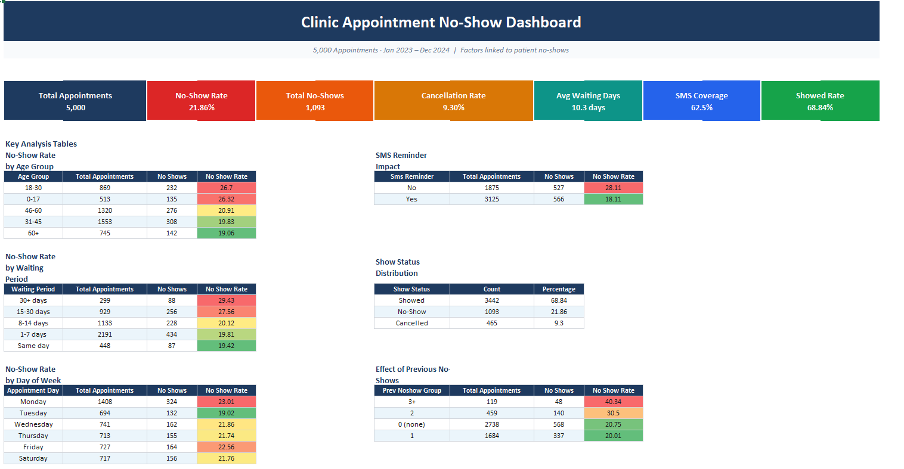
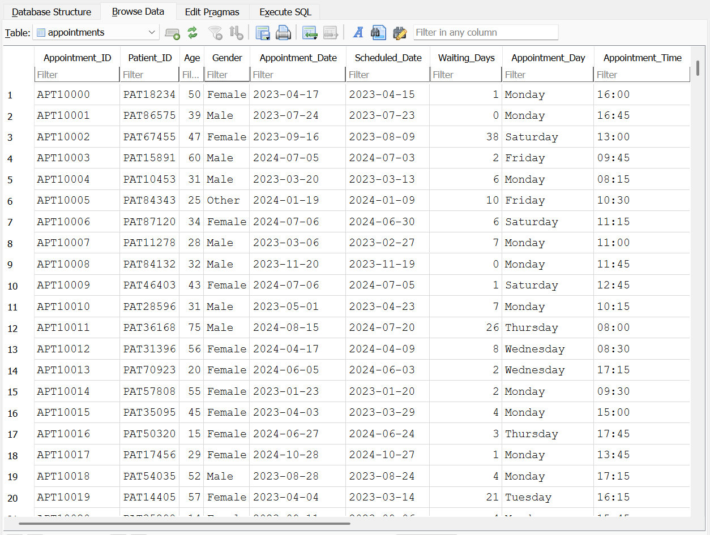

# 🏥 CareQueue Analytics - Clinic No-Show Dashboard

> A Python data analysis project that looks at what factors are linked to patients missing their clinic appointments, using synthetic appointment data, SQL queries, and an Excel dashboard.

---

## 📋 Table of Contents

- [Project Overview](#project-overview)
- [Screenshots](#screenshots)
- [Dataset](#dataset)
- [Project Structure](#project-structure)
- [How the Code Works](#how-the-code-works)
  - [Step 1 - generate_data.py](#step-1---generate_datapy)
  - [Step 2 - sql_analysis.py](#step-2---sql_analysispy)
  - [Step 3 - build_excel.py](#step-3---build_excelpy)
- [SQL Queries Explained](#sql-queries-explained)
- [Key Findings](#key-findings)
- [Recommendations](#recommendations)
- [Installation and Setup](#installation-and-setup)
- [Run Order](#run-order)
- [Technologies Used](#technologies-used)

---

## Project Overview

This project is built around a real problem in healthcare: patients booking appointments and then not showing up. It costs clinics time and money, and means other patients miss out on slots.

The core question I wanted to answer was:

**"What factors are linked to patients missing their clinic appointments?"**

To explore this, I generated a realistic synthetic dataset of 5,000 appointments, stored everything in a SQLite database, ran SQL analysis across several different angles, and put together a formatted Excel dashboard with charts, tables, and practical recommendations.

---

## Screenshots

### Excel Dashboard
The final output from `build_excel.py`. It includes 7 sheets covering KPI cards, analysis tables with colour-scale formatting, embedded charts, high-risk segments, and recommendations. The Executive Summary sheet shown below gives a view of the most important numbers.



The colour coding on the no-show rate column makes it easy to spot which groups are highest risk at a glance. Red means high no-show rate, yellow is medium, and green is low. You can see straight away that the 18-30 age group (26.7%) and patients who did not receive an SMS reminder (28.11%) stand out as the biggest problem areas.

---

### SQLite Database
This is what the generated dataset looks like when viewed in DB Browser for SQLite. Each row is one appointment record with all 16 columns populated. The data was created by `generate_data.py` and saved to `clinic.db`, which is then queried by `sql_analysis.py`.



You can see columns like `Appointment_ID`, `Patient_ID`, `Age`, `Appointment_Date`, `Scheduled_Date`, `Waiting_Days`, and `Appointment_Day` all populated with realistic values. Row 3 for example shows a patient who waited 38 days for their appointment, which based on the analysis is the kind of booking most likely to result in a no-show.

---

## Dataset

The dataset has **5,000 appointment records** covering January 2023 to December 2024. Here is what each column represents:

| Column | Description |
|---|---|
| `Appointment_ID` | Unique ID for each appointment (e.g. APT10001) |
| `Patient_ID` | Unique patient identifier (e.g. PAT67455) |
| `Age` | Patient age between 1 and 95, normally distributed around 42 |
| `Gender` | Male / Female / Other |
| `Appointment_Date` | The date of the actual appointment (YYYY-MM-DD) |
| `Scheduled_Date` | The date the patient booked the appointment |
| `Waiting_Days` | Number of days between booking and the appointment |
| `Appointment_Day` | Day of the week (Monday to Saturday) |
| `Appointment_Time` | Time of appointment (HH:MM, between 08:00 and 17:45) |
| `Clinic_Type` | General Practice / Cardiology / Pediatrics / Orthopedics / Dermatology / Neurology |
| `Appointment_Type` | Consultation / Follow-up / Routine Check-up / Emergency / Procedure / Lab Test |
| `SMS_Reminder` | Whether an SMS reminder was sent before the appointment (Yes / No) |
| `Previous_No_Shows` | How many times the patient has previously not shown up (0 to 5) |
| `Insurance_Type` | Private / Public / None / Medicare / Medicaid |
| `Neighbourhood` | The patient's local area, one of 10 possible neighbourhoods |
| `Show_Status` | The target variable - either Showed, No-Show, or Cancelled |

---

## Project Structure

```
clinic_project/
│
├── generate_data.py              # Step 1: Creates the dataset
├── sql_analysis.py               # Step 2: Runs SQL queries and saves results
├── build_excel.py                # Step 3: Builds the Excel dashboard
│
├── images/
│   ├── Exceldashboard.png        # Screenshot of the Excel output
│   └── SQLlite.png               # Screenshot of the SQLite database
│
├── appointments.csv              # Auto-generated: raw dataset in CSV format
├── clinic.db                     # Auto-generated: SQLite database
├── query_results.pkl             # Auto-generated: saved query results
└── Clinic_NoShow_Dashboard_v2.xlsx  # Auto-generated: the final Excel report
```

> **Note:** The `.csv`, `.db`, `.pkl`, and `.xlsx` files are all created automatically when you run the scripts. You only need the three `.py` files to get started.

---

## How the Code Works

### Step 1 - `generate_data.py`

**What it does:** Builds a realistic synthetic dataset and saves it as both a CSV file and a SQLite database.

**1. Sets up base no-show probabilities**

Each clinic type, appointment type, and day of the week gets a starting probability of a patient not showing up, based on patterns you would expect in a real healthcare setting:

```python
CLINIC_P = {
    "Dermatology": 0.33,      # highest risk
    "Orthopedics": 0.27,
    "General Practice": 0.24,
    ...
}
```

**2. Generates 5,000 patient records**

For each record it randomly picks:
- A patient age (normal distribution, mean of 42)
- A clinic, appointment type, insurance type, and neighbourhood
- A scheduled date somewhere in the 2023 to 2024 range
- A waiting period using an exponential distribution, so most waits are short but some stretch out
- Whether an SMS reminder was sent (62% chance of yes)
- How many previous no-shows the patient has, using a Poisson distribution

**3. Works out the no-show probability for each patient**

The base probability gets adjusted up or down depending on that patient's specific situation:

```python
p_ns = (CLINIC_P[clinic] + APTYPE_P[apt_type] + DAY_P[apt_day]) / 3

if wait_days > 14:      p_ns += 0.09   # longer wait = higher risk
if sms:                 p_ns -= 0.11   # reminder sent = lower risk
if prev_ns >= 2:        p_ns += 0.12   # history of no-shows = higher risk
if age < 30:            p_ns += 0.05   # younger patients = higher risk
if insurance == "None": p_ns += 0.04
```

**4. Assigns a Show_Status to each record**

A random number is drawn for each patient. If it lands below the no-show probability, the status becomes `No-Show`. If it falls in the next band up, it becomes `Cancelled`. Anything above that is `Showed`.

**5. Saves the output**

- `appointments.csv` for general use in Excel or other tools
- `clinic.db` as a SQLite database ready for SQL queries

---

### Step 2 - `sql_analysis.py`

**What it does:** Connects to the SQLite database and runs 10 SQL queries to analyse the data from different angles.

**1. Connects to the database**
```python
conn = sqlite3.connect("clinic.db")
```

**2. Runs each query through pandas**
```python
df = pd.read_sql_query(sql, conn)
```
This runs the SQL and brings the results back as a pandas DataFrame, which makes it easy to print, save, and hand off to the Excel builder.

**3. Saves all results to a pickle file**
```python
with open("query_results.pkl", "wb") as f:
    pickle.dump(results, f)
```
A pickle file saves Python objects directly to disk. This means `build_excel.py` can just load the results straight away without having to re-run all the queries again.

**The 10 queries cover:**
- Overall no-show and cancellation rates
- No-show rate by age group
- No-show rate by waiting period
- No-show rate by SMS reminder
- No-show rate by clinic type
- No-show rate by appointment type
- No-show rate by day of week
- No-show rate by previous no-show history
- Appointment volume broken down by month
- Top 10 highest-risk patient segments using a cross-tabulation

---

### Step 3 - `build_excel.py`

**What it does:** Reads the saved query results and builds a properly formatted multi-sheet Excel workbook.

**1. Loads the query results**
```python
with open("query_results.pkl", "rb") as f:
    results = pickle.load(f)
```

**2. Sets up a colour palette and reusable style functions**

Helper functions handle fonts, background fills, borders, and text alignment so all the tables look consistent throughout the workbook:
```python
def ff(size=10, bold=False, color="1A1A1A"):
    return Font(name="Calibri", size=size, bold=bold, color=color)

def fill(hex_c):
    return PatternFill("solid", fgColor=hex_c)
```

**3. Writes out 7 sheets**

| Sheet | Contents |
|---|---|
| Executive Summary | KPI cards and all key summary tables with colour-scale formatting |
| SQL Queries | All 10 SQL queries laid out as formatted code blocks |
| Charts | 6 embedded Excel charts including bar, column, line, and pie |
| Analysis Tables | Full results from every query |
| High-Risk Segments | Top 10 patient and clinic combinations with the highest no-show rates |
| Recommendations | 5 action cards with detail on how to reduce no-shows |
| Raw Data Sample | 1,000 styled rows taken from the appointments dataset |

**4. Adds conditional formatting**

The no-show rate columns use a green to yellow to red colour scale so you can immediately spot which rows are high risk:
```python
ws.conditional_formatting.add(range,
    ColorScaleRule(start_color="63BE7B",   # green = low risk
                   mid_color="FFEB84",     # yellow = medium risk
                   end_color="F8696B"))    # red = high risk
```

**5. Embeds the charts**

Charts are built using openpyxl's chart tools and pull from the data tables already written into each sheet:
```python
ch = BarChart()
data = Reference(ws, min_col=3, min_row=1, max_row=6)
ch.add_data(data, titles_from_data=True)
ws.add_chart(ch, "E4")
```

---

## SQL Queries Explained

### Overall no-show rate
This one counts all appointments and works out what percentage ended up as no-shows. It uses a `CASE WHEN` expression inside a `SUM()` which is a handy SQL pattern for conditional counting.

```sql
SELECT 
    COUNT(*) AS total_appointments,
    SUM(CASE WHEN show_status = 'No-Show' THEN 1 ELSE 0 END) AS no_shows,
    ROUND(
        SUM(CASE WHEN show_status = 'No-Show' THEN 1 ELSE 0 END) * 100.0 / COUNT(*), 2
    ) AS no_show_rate
FROM appointments;
```

### No-show rate by age group
Uses a `CASE WHEN` to group patients into age bands before aggregating. This turns a continuous number into something more useful to work with.

```sql
SELECT 
    CASE 
        WHEN age < 18 THEN '0-17'
        WHEN age BETWEEN 18 AND 30 THEN '18-30'
        WHEN age BETWEEN 31 AND 45 THEN '31-45'
        WHEN age BETWEEN 46 AND 60 THEN '46-60'
        ELSE '60+'
    END AS age_group,
    COUNT(*) AS total_appointments,
    ROUND(
        SUM(CASE WHEN show_status = 'No-Show' THEN 1 ELSE 0 END) * 100.0 / COUNT(*), 2
    ) AS no_show_rate
FROM appointments
GROUP BY age_group
ORDER BY no_show_rate DESC;
```

### No-show rate by waiting days
Same approach as the age group query but applied to waiting days. It buckets the raw number of days into time bands that are easier to read and act on.

```sql
SELECT 
    CASE 
        WHEN waiting_days = 0 THEN 'Same day'
        WHEN waiting_days BETWEEN 1 AND 7 THEN '1-7 days'
        WHEN waiting_days BETWEEN 8 AND 14 THEN '8-14 days'
        WHEN waiting_days BETWEEN 15 AND 30 THEN '15-30 days'
        ELSE '30+ days'
    END AS waiting_period,
    COUNT(*) AS total_appointments,
    ROUND(
        SUM(CASE WHEN show_status = 'No-Show' THEN 1 ELSE 0 END) * 100.0 / COUNT(*), 2
    ) AS no_show_rate
FROM appointments
GROUP BY waiting_period
ORDER BY no_show_rate DESC;
```

### No-show rate by SMS reminder
A straightforward `GROUP BY` on a Yes/No column. It directly shows the difference in no-show rates between patients who got a reminder and those who did not.

```sql
SELECT 
    sms_reminder,
    COUNT(*) AS total_appointments,
    ROUND(
        SUM(CASE WHEN show_status = 'No-Show' THEN 1 ELSE 0 END) * 100.0 / COUNT(*), 2
    ) AS no_show_rate
FROM appointments
GROUP BY sms_reminder;
```

---

## Key Findings

| Factor | Finding |
|---|---|
| **SMS Reminder** | Patients without a reminder had a **28.11%** no-show rate. With a reminder it dropped to **18.11%**. That is a 10 percentage point difference. |
| **Previous No-Shows** | Patients with 3 or more prior no-shows had a **40.34%** no-show rate, nearly double the overall average. |
| **Waiting Days** | Waits of 15 to 30 days reached **27.56%** no-show. Waits over 30 days hit **29.43%**. Same-day bookings were only **19.42%**. |
| **Age Group** | The 18 to 30 age group had the highest no-show rate at **26.70%**. |
| **Day of Week** | Monday was the worst day at **23.01%**. Tuesday had the lowest rate at **19.02%**. |
| **Clinic Type** | Dermatology had the highest rate at **25.51%**. Neurology was the lowest at **19.85%**. |
| **Appointment Type** | Lab Tests (**23.76%**) and Consultations (**23.73%**) were the riskiest appointment types. |

---

## Recommendations

1. **Send SMS reminders to patients with longer wait times.** The reminder alone brought the no-show rate down by 10 percentage points. Right now only 62% of patients are getting one, so expanding coverage is probably the quickest win available.

2. **Prioritise follow-up contact for patients with a history of no-shows.** Anyone with 2 or more previous no-shows should get a personal phone call in addition to an SMS, not just the standard reminder.

3. **Avoid scheduling high-risk appointment types too far in advance.** Lab Tests and Consultations have the highest no-show rates. Where it is clinically safe to do so, try to keep the lead time under 7 days for these.

4. **Add confirmation calls for appointments booked more than 14 days ahead.** The no-show rate climbs sharply past the 14-day mark. A quick call at the 7-day point can confirm the patient is still coming or free up the slot for someone else.

5. **Monitor no-show trends by day of week to improve staffing and scheduling.** Monday consistently has the highest no-show rate. Building in a small overbooking buffer on Mondays and encouraging mid-week rescheduling could help balance things out.

---

## Installation and Setup

### What you need
- Python 3.8 or higher
- PyCharm (Community Edition works fine) or any Python IDE you prefer

### Install the required libraries

Open your terminal or the PyCharm terminal and run:

```bash
pip install pandas numpy faker openpyxl
```

> `sqlite3` comes built into Python so you do not need to install it separately.

### Clone the project

```bash
git clone https://github.com/alexho01/CareQueue-Analytics.git
cd CareQueue-Analytics
```

---

## Run Order

Run the three scripts in this order, otherwise they will not work correctly:

```bash
# Step 1 - Generate the dataset
python generate_data.py

# Step 2 - Run the SQL analysis
python sql_analysis.py

# Step 3 - Build the Excel dashboard
python build_excel.py
```

Once Step 3 finishes, open `Clinic_NoShow_Dashboard_v2.xlsx` to see the full dashboard.

If you want to explore the SQLite database directly, download **DB Browser for SQLite** from [sqlitebrowser.org](https://sqlitebrowser.org). It is free and gives you a simple visual interface to browse tables and run your own queries.

---

## Technologies Used

| Tool | Purpose |
|---|---|
| **Python 3** | Core programming language |
| **pandas** | Data manipulation and handling SQL query results |
| **numpy** | Random number generation and probability calculations |
| **Faker** | Generating realistic fake patient IDs |
| **sqlite3** | Built-in Python library for working with SQLite |
| **openpyxl** | Building and formatting the Excel output file |
| **SQLite** | Lightweight file-based database that needs no server setup |

---

## Notes

- All data in this project is completely synthetic. No real patient information was used at any point.
- The no-show probabilities are based on patterns you would expect to see in a real clinic setting, but they are not taken from any actual dataset.
- SQLite was chosen over MySQL or PostgreSQL because it runs entirely as a local file, so there is nothing to install or configure on a server. If you ever want to move to MySQL, only the database connection line would need to change. All the SQL queries are written in standard SQL and would work as-is.

---

*Built as a healthcare data analytics portfolio project to practise SQL, Python, and Excel dashboard skills.*
